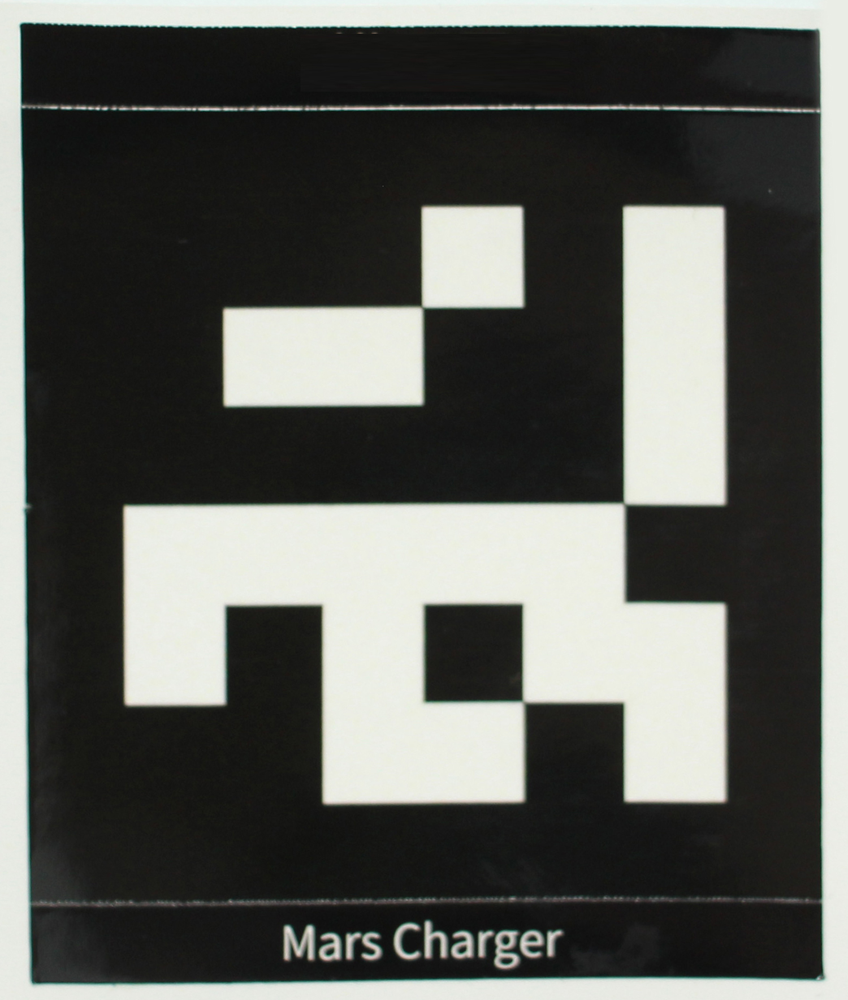
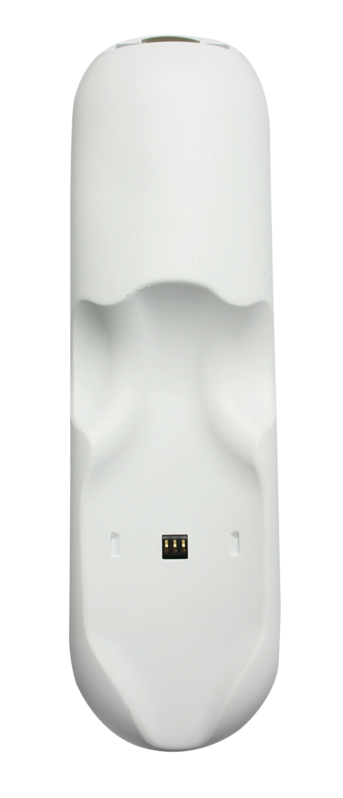

# 2.MarsCat and accessories

## 2.1 MarsCat

**Structure Illustration**

**Product Parameter**

| Name:                     | MarsCat                                                                        | Speaker:                | 1Speaker, 1Microphone                           |
| ------------------------- | ------------------------------------------------------------------------------ | ----------------------- | ----------------------------------------------- |
| **Model:**          | MARS-1001                                                                      | **Sensors:**           | Capative Touch Sensor                           |
| **Age to use:**     | 12+                                                                            | **Switches:**          | 1 Power Button                                  |
| **Joints:**         | 16(Head*2, Legs: 4(Legs) ×3(Joints),Tails×2)                                 | **Interface:**         | Type-C(USB), DC JACK(charging port),HDMI        |
| **Material:**       | Plastic + Glass(eye)+Rubber(Ear, Neck and Paw)                                 | **Communications:**    | BLUETOOTH                                       |
| **Color:**          | White, Black, Grey, Ginger                                                     | **Power Consumption:** | Approx. 20W                                     |
| **Size:**           | Lie Down: 388(L)×268(W)×240(H) Without Tail/ 578(L)×268(W)-240(H) with Tail | **Battery:**           | 7.2V, 6.7Ah                              |
| **Weight:**         | 2.9KG                                                                          | **Battery Duration:**  | 2 Hours Regular Motion, 3-4Hours Regular Motion |
| **MicroProcessor:** | Raspberry Pi 3B(wifi)-Quad-Core ARM Cortex-A53CPU,1GB RAM                      | **Charge:**            | Charging Station/Power Adapter; 8.4V/2A(Max)    |
| **Display:**        | 20LEDs(EYES), 128×128px, 1.5 Inch                                             | **Charge Duration:**   | 4-6 hours                                       |
| **Camera:**         | 5M Pixel Camera, 72 degree                                                     | **Accessories:**       | Type-C USB, Cat Bowl          |
|                           |                                                                                | **Toys:**              | Cat Ball, Cat Teaser              |

## 2.2 Charging Station
When you receive the goods, the charging pile assemblies you receive after unpacking are shown in the figure below

    

** Please follow the following steps to assemble the charging pile **

1. Select a QR code sticker
2. Attach the QR code sticker to the position as shown in the picture

    

3. Insert the plug-in plate with the QR code into the charging pile base
4. The assembled charging pile is shown in the figure

**Note:**

- To let MarsCat charge its battery on its own on the charging station (self-charging) and get up from there, do not place objects, which may disturb MarsCat's activities, around the charging station.
- Choose an open bright place without direct sunlight to place the charging station and avoid a place subject to high room temperatures of 35 °C (95 °F) and higher.
- Do not touch the charge connector with bare hands to avoid causing a bad contact.
- Do not exert force on the charging station, for example, step on or kick the charging station.
- Do not allow the charging station to be exposed to water or spill any type of liquids.

**Product Parameter**

| Power supply   | 8.4V                      |
| -------------- | ------------------------- |
| Output voltage | 8.4V                      |
| Charging time  | About 4-6 hours           |
| Temperature    | 5°C-35°C（41°F-95°F） |
| Size           | 360×100×177（cm）       |
| Weight         | 1.27kg                    |

## 2.3 Charger

    

**Note:**

- Use the supplied power adapter with the charging station. Use of any power adapter other than the supplied one will cause a malfunction of MarsCat.
- For connecting the power adapter to a power outlet that is easy to access.
- Any problem happens during charging, immediately unplug the power cord from the power outlet to cut the power supply.
- To avoid the risk of heat generation or a malfunction of the adapter, unplug the power cord from the power outlet after the charging is completed.
- The supplied power adaptor is exclusively designed for MarsCat's charging station. It should not be used with any other electric devices.
- To purchase a new one, please visit our offificial website:[https://shop.elephantrobotics.com/.](https://www.elephantrobotics.com/.)
- The plug of the charger can be replaced

**Product Parameter**

| Input voltage  | 220V            |
| -------------- | --------------- |
| Output voltage | 8.4V 2A         |
| Charging time  | About 3 hours   |
| Size           | 8×5×3.5（cm） |
| Temperature    | 5℃-35℃        |
| Cable length   | 1m              |

## 2.4 MarsBowl

When you receive the goods, the cat bowl assemblies you receive after unpacking are shown below

    

** Please follow these steps to assemble the cat bowl **

1. Select a QR code sticker
2. Attach the QR code sticker to the position as shown in the picture

    

3. Insert the insert plate with the QR code into the base of the cat bowl
4. The finished cat bowl is shown in the picture

    

**Note:**

- To ensure MarsCat can accurately identify MarsBowl, do not place any other objects around MarsBowl that may interfere with MarsCat's activity.
- Please choose a bright room without direct sunlight to place MarsBowl.
- Do not exert excessive force on MarsBowl, for example, press or step on MarsBowl.

## 2.5 Toys

Customer can use toys as follows to play with MarsCat.

- Ball(supplied)

    

- Teaser(supplied)

    

It is specially designed for MarsCat, when MarsCat see toys, he/she may approach the toys and make a pounce or kick.

