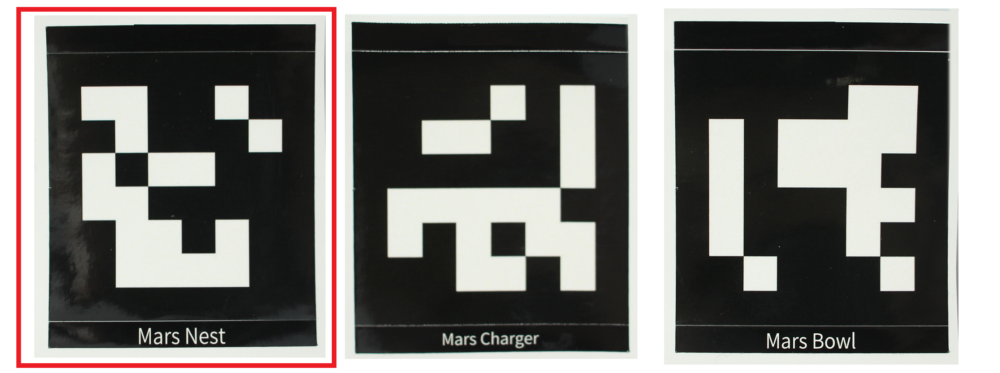

# 3.Begin your life with MarsCat

## 3.1 Read before unboxing

1.Please check whether the package is damaged or not before opening，please refer to the following figure for specific unpacking diagram:

2.Please do not unpack the box violently to avoid a physical injury or a malfunction of MarsCat, be careful and light.

3.Please check all items carefully in the box. If there is any omission, please contact the customer service in time.

- Thank-You Card, Quick Start Guide, Usage instruction and Important Tips, please read Important Tips first.
- Charging Station, Charger, MarsBowl, and Toys
  **Note:**MarsCat itself and its tail. The tail is removed and stored in the separate place for safety, users need to install it by themselves(remove the rubber sleeve from the receptacle hole of the tail and push the tail into it).

## 3.2 Turn on MarsCat: Wake up MarsCat

- Step1 Press and hold the power button art the belly of MarsCat for 2 seconds. The status LED lights in blue and MarsCat is turned on.

**Note:** Press and hold the button, and you should release the button when the power light turns blue. 

It takes some time when you firstly turn on MarsCat, you should be patient.

**Do not press the power button frequently.**

- Step2 Lay down MarsCat on a flat and clean floor as shown below. Wait for a while until MarsCat starts to move.

**Note: It is neccessary to lay down MarsCat as shown in the picture, or you will fail to turn on MarsCat.**

- Step3 When MarsCat gets up and stands still, proceed to “set up MarsCat with MarsAPP”

## 3.3 Getting the living environment ready
After the cat bowl and charging pile are assembled, the living environment of MarsCat can be arranged. In order to ensure that MarsCat can leave the charging pile after eating and charging, do not place any objects around the cat bowl and charging pile that may interfere with the activities of MarsCat's Martian bionic cat

When MarsCat enters foraging mode, it will walk to the cat bowl and eat when it recognizes the QR code of the cat bowl

The charging pile is used to charge the MarsCat. For details, see [** How to Charge **](./4-Raising-MarsCat.md).

In the QR code you received, there is also a QR code belonging to the cat's nest. You can post this QR code at any position (within the height of camera recognized by MarsCat). After MarsCat successfully identifies the QR code, it will autonomously navigate to the cat's nest

    

## 3.4 Set up MarsCat

Download MarsApp to personalize MarsCat. For details, see [**MarsApp**](.. /6-MarsApp.md)

## 3.5 Turn off MarsCat

If you want to turn off MarsCat, press and hold the power button at the belly of MarsCat for 5 seconds. The status LED lights in red first and then turns off later, don't stop pressing the button until the status LED goes off.
