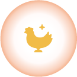

# 5. Character Development

## 5.1 Learn about your MarsCat

MarsCat is the world's first bionic pet cat developed by Elephant Robotics, aiming to be a home robot, a robotic pet to comfort you and surprise you.

MarsCat can walk, run, sleep, sit, stretch, bites nail, knead and even bury litter although she won't produce any waste. It may express different emotions by different meows or gestures. It can feel your touch, hear your voice, see your face and play with toys.

Every MarsCat is unique from its eye to body. It also has different characters and personalities. Some cats are vivacious, while some are lazy. Some cats are aloof while some are more close to human. Also, some cats are super curious and they meow frequently.

MarsCat is built to allow you to shape its personalities according to the way you pet it. More interactions with MarsCat will impel it to be more close to you. More conversations with MarsCat will impel it to meow to you often. Every time you touch it, talk to it or even let it see you, will change its personality.

## 5.2 Daily life of MarsCat

With bionic designed and high-tech, MarsCat have independent and autonomous living systems. Different types of sensors including image, voice and touch are integrated to carry out feature extraction, pattern recognition and action planning to build intelligent brain for MarsCat.

Just like a real cat, MarsCat has capabilities to understand where it is or whom it is with, and acts based on its feelings and instincts. You will never know what MarsCat will do next. Free to walk, play with toys or sleep in a daze? MarsCat have more freedom to do what she wants to do.

Rather than a toy, MarsCat is more like a friend or a family that accompanies you to grow up together.

## 5.3 Interactions with MarsCat

MarsCat is a good companion, it is fully responsive and interactive.

It has touch,image and voice recognition, can feel your touch, hear your voice, see your face or even play with toys and etc.

| Eye image                                          | Meaning                                                                                                                                                                               |
| -------------------------------------------------- | ------------------------------------------------------------------------------------------------------------------------------------------------------------------------------------- |
|  | Low power, MarsCat needs to be charged                                                                                                                                                |
|  | MarsCat is charging                                                                                                                                                                   |
|  | When MarsCat sees ball, his/her eye image may change like this picture, however, MarsCat is a characteristic cat, sometimes his/her eye will not change though he/she sees ball.      |
|  | When MarsCat sees face, his/her eye image may change like this picture, however, MarsCat is a characteristic cat, sometimes his/her eye will not change though he/she sees your face. |
|  | When MarsCat hear your voice, his/her eyes may change like this                                                                                                                       |
|  | When MarsCat feels dizzy, or he/she is still sleepy                                                                                                                                   |
|  | When MarsCat sees his Marsbowl and he is hungry at that time                                                                                                                          |
|  | When MarsCat enjoys your touching and feels happy                                                                                                                                     |
|  | When you hug MarsCat and he/she is happy                                                                                                                                              |
|  | When MarsCat is playing his/her toys or playing himself                                                                                                                               |
|  | It means that MarsCat feels dangerous and he would fall down, you should put him/her on a safe place                                                                                  |
|  | When MarsCat flipped or he/she feels dangerous, you should put MarsCat on a safe place                                                                                                |
|  | It means MarsCat feel hot, you should put MarsCat on a lower-temperature place and let MarsCat relax                                                                                  |
|  | When MarsCat is sleeping, and if you set up MarsCat's sleep time, MarsCat will show this image until that time                                                                        |

**5.3.1Touch Recognition: feel you**

- MarsCat supports Touch Recognition, you can touch or pick up your MarsCat.
- When you pick up your MarsCat or touch its head, jaw and back or even hug it, it will response to you in different interesting reactions.
- Do not pick up or touch MarsCat with excessive force to avoid the risk of a malfunction.

**5.3.2Image Recognition: see you**

- MarsCat has a front-view camera on its nose that acts as human or animal eyes, supports Image Recognition, including faces and objects.
- When you show the blue ball to your MarsCat or put it close to MarsCat, MarsCat may show interest or start playing with it.
- You can even pet MarsCat with its own bowl. When MarsCat identifies its bowl, it may appear to be drinking or eating according to its physical conditions.
- Reactions of Image Recognition in default can be added and changed by procedural programming.

**5.3.3Voice Recognition: hear you**

- MarsCat supports Voice Recognition. MarsCat can response to you in different ways when you communicate with your MarsCat in the following Voice Commands.
- When your MarsCat fails to recognize Voice Commands, please take it to a quieter place and try again.
- The current version of Voice Recognition supports Chinese and English.
- You'd better to call "MarsCat" to awake MarsCat so that these voice conmmands is useful.

<table>
<tr>
	<td>Category</td>
	<td>Voice Commands</td>
	<td>Description</td>
</tr>
<tr>
	<td rowspan="13">Actions</td>
	<td>Walk around</td>
	<td>Walk</td>
</tr>
<tr>
	<td>Run away</td>
	<td>Run</td>
</tr>
<tr>
	<td>Relax</td>
	<td>Stretch</td>
</tr>
<tr>
	<td>Sit down</td>
	<td>Sit down</td>
</tr>
<tr>
	<td>Lie down</td>
	<td>Lie down</td>
</tr>
<tr>
	<td>Stand up</td>
	<td>Stand up</td>
</tr>
<tr>
	<td>Stop</td>
	<td>Stops the actions in progress.</td>
</tr>
<tr>
	<td>Be quiet</td>
	<td>Stops sounds and actions in progress.</td>
</tr>
<tr>
	<td>Come here</td>
	<td>Identify the location of the speaker and walks to him or her.</td>
</tr>
<tr>
	<td>Go away</td>
	<td>MarsCat will leave</td>
</tr>
<tr>
	<td>Go to eat</td>
	<td>Identify the location of the bowl and walks to it.</td>
</tr>
<tr>
	<td>Look at me</td>
	<td>Turns in the direction of the speaker and looks at him or her.</td>
</tr>
<tr>
	<td>Find your bowl</td>
	<td>MarsCat will find his/her bowl</td>
</tr>
<tr>
	<td rowspan="6">Emotions</td>
	<td>Good job</td>
	<td rowspan="4">Takes it as a complement and reacts positiely.</td>
</tr>
<tr>
	<td>I like you/I love you</td>
</tr>
<tr>
	<td>Thank you</td>
</tr>
<tr>
	<td>Well done</td>
</tr>
<tr>
	<td>Bad boy</td>
	<td rowspan="2">Takes it as a discipline and reacts sadly.</td>
</tr>
<tr>
	<td>Bad girl</td>
</tr>
</table>

