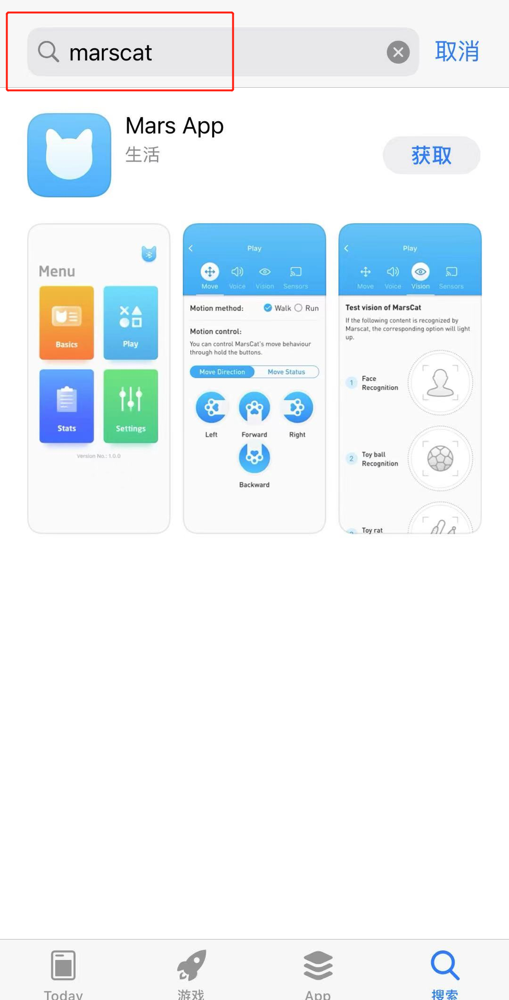
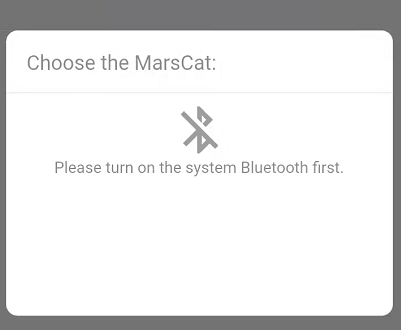
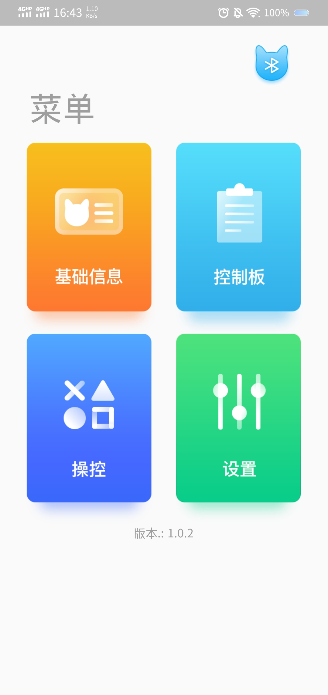
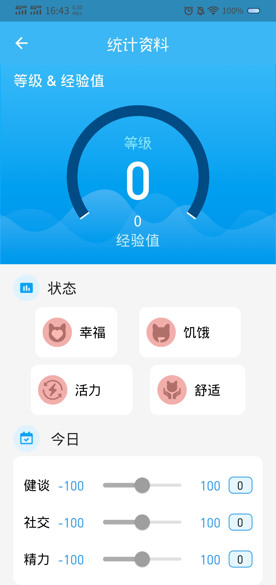

# 6.MarsApp

## 6.1 Introduction

MarsApp is designed for you to better interact with MarsCat, and help you enjoy the life of MarsCat.

**Installation**

Install the MarsApp to your smartphone.

1.Official website to download: [MarsCat – Elephant Robotics](https://www.elephantrobotics.com/en/mars-en/)

You can find download on official website shown in the following picture.

2.search marscat on Apple Store

**Version Support**

Supported operating system for MarsApp for smartphones

**Language Support**

- Chinese
- English

**Online settings**

Open app--click connecting Bluetooth--choose the MarsCat you want to connect

- Search successfully: the page shows "connect", click it
- Search unsuccessfully: the page shows "not find MarsCat"

If the search fails, please check the status of your Bluetooth and MarsCat and try again.

**Software update**

It is recommend to update your MarsApp to the latest version.

**Unable to connect**

1. MarsCat's Bluetooth signal could not be searched

**Solution**: Restart MarsCat & Reload MarsApp

2.Staying on the Bluetooth connection page, and you can't turn on Bluetooth

**Solution**: When the App is first used, a request permission box pops up, If you don't see the request permission box after updating the App, you should give the app permission in the phone settings and try again.

## 6.2 How to use MarsApp

Follow the on-screen instructions to set up MarsCat with MarsApp.

P1: Learn the basic parameters for personalization settings.

You can visit "Basics" in the menu to

- Set MarsCat's eye color
- Set MarsCat's sex
- Set MarsCat's sleep time

P2: Record dynamic data in real time to track growth trajectory.

You can use "Status" in the menu to

- Learn about MarsCat's Levels and Experience Values
- Learn about the status of MarsCat
- Learn about MarsCat's daily index

P3: Remote control to unlock more interactive games

You can visit "Play" in the menu to

- Control MarsCat's move
- Check MarsCat's voice
- Check MarsCat's vision
- Check MarsCat's sensor
