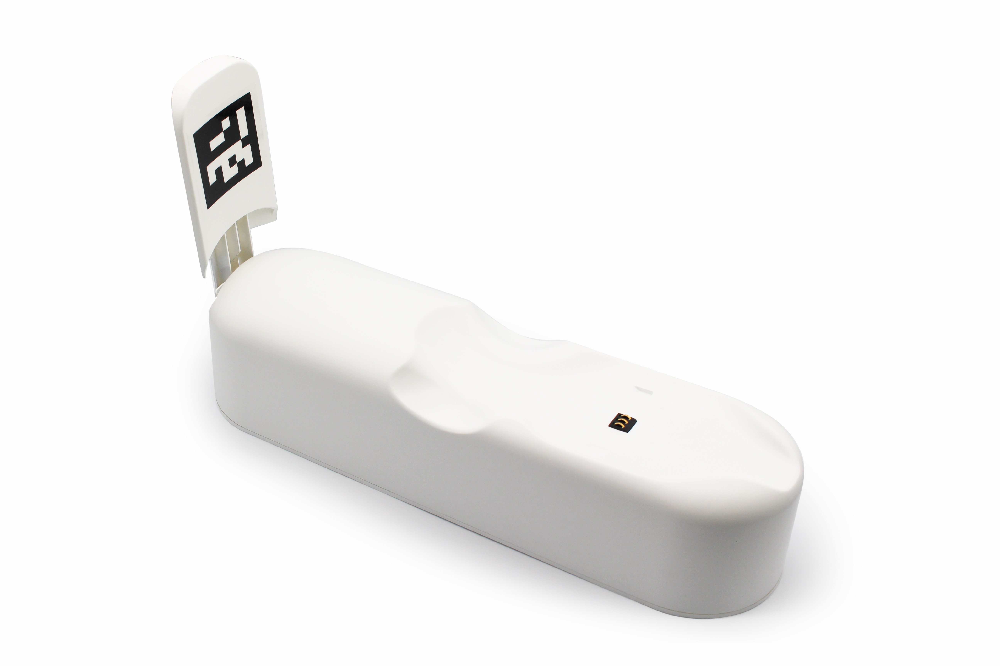
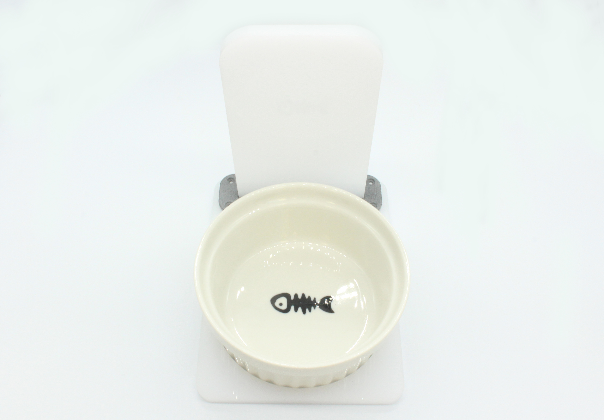
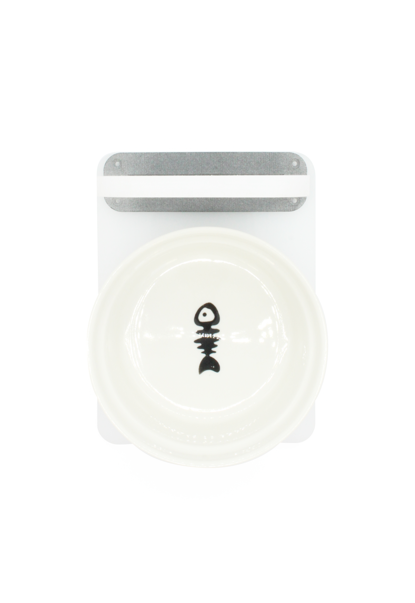
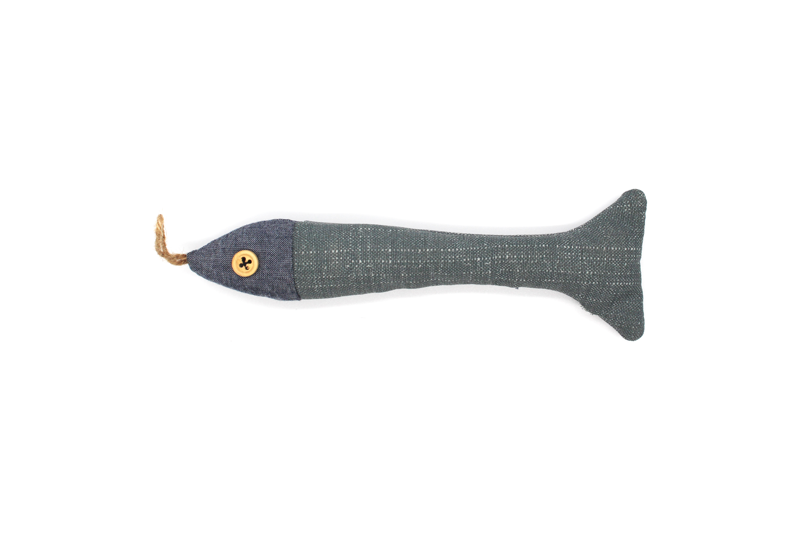

# 2.MarsCat and accessories

## 2.1 MarsCat

**Structure Illustration**

**Product Parameter**

## 2.2 Charging Station

**Note:**

- To let MarsCat charge its battery on its own on the charging station (self-charging) and get up from there, do not place objects, which may disturb MarsCat’s activities, around the charging station.
- Choose an open bright place without direct sunlight to place the charging station and avoid a place subject to high room temperatures of 35 °C (95 °F) and higher.
- Do not touch the charge connector with bare hands to avoid causing a bad contact.
- Do not exert force on the charging station, for example, step on or kick the charging station.
- Do not allow the charging station to be exposed to water or spill any type of liquids.

**Product Parameter**

| Power supply   | 8.4V                      |
| -------------- | ------------------------- |
| Output voltage | 8.4V                      |
| Charging time  | About 3-5 hours           |
| Temperature    | 5°C-35°C（41°F-95°F） |
| Size           | 360×100×177（cm）       |
| Weight         | 1.27kg                    |

## 2.3 Charger

The ex-factory plug of the power supply has 2 circular holes, and we will provide a converter free according to your country. If the provided converter is not suitable, please purchase it by yourself.

**Note:**

- Use the supplied power adapter with the charging station. Use of any power adapter other than the supplied one will cause a malfunction of MarsCat.
- For connecting the power adapter to a power outlet that is easy to access.
- Any problem happens during charging, immediately unplug the power cord from the power outlet to cut the power supply.
- To avoid the risk of heat generation or a malfunction of the adapter, unplug the power cord from the power outlet after the charging is completed.
- The supplied power adaptor is exclusively designed for MarsCat's charging station. It should not be used with any other electric devices.
- To purchase a new one, please visit our offificial website:[https://shop.elephantrobotics.com/.](https://www.elephantrobotics.com/.)

**Product Parameter**

| Input voltage  | 220V            |
| -------------- | --------------- |
| Output voltage | 8.4V 2A         |
| Charging time  | About 3 hours   |
| Size           | 8×5×3.5（cm） |
| Temperature    | 5℃-35℃        |
| Cable length   | 1m              |
|                |                 |

## 2.4 MarsBowl

When you receive your box, you should connect MarsBowl shown in the picture.

**Note:**

- To ensure MarsCat can accurately identify MarsBowl, do not place any other objects around MarsBowl that may interfere with MarsCat's activity.
- Please choose a bright room without direct sunlight to place MarsBowl.
- Do not exert excessive force on MarsBowl, for example, press or step on MarsBowl.

## 2.5 Toys

Customer can use toys as follows to play with MarsCat.

- Toy Fish(supplied)
- Ball(supplied)

It is specially designed for MarsCat, when MarsCat see this ball, he/she may approach the ball and make a pounce or kick.
