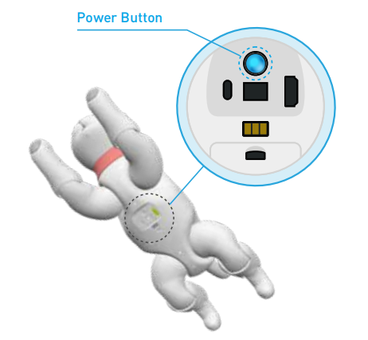

# 3.Begin your life with MarsCat

## 3.1 Read before unboxing

1.Please check whether the package is damaged or not before opening

2.Please do not unpack the box violently to avoid a physical injury or a malfunction of MarsCat, be careful and light.

3.Please check all items carefully in the box. If there is any omission, please contact the customer service in time.

- Thank-You Card, Quick Start Guide, Usage instruction and Important Tips, please read Important Tips first.
- MarsCat itself and its tail. The tail is removed and stored in the separate place for safety, users need to install it by themselves(remove the rubber sleeve from the receptacle hole of the tail and push the tail into it).
- Charging Station, Charger, MarsBowl, Changeable pads\*4 and Toys(Ball)

## 3.2 Turn on MarsCat: Wake up MarsCat

- Step1 Press and hold the power button art the belly of MarsCat for 2 seconds. The status LED lights in blue and MarsCat is turned on.

**Note:** Press and hold the button, and you should release the button when the power light turns blue. 

It takes some time when you firstly turn on MarsCat, you should be patient.

**Do not press the power button frequently.**

- Step2 Lay down MarsCat on a flat and clean floor as shown below. Wait for a while until MarsCat starts to move.

**Note: It is neccessary to lay down MarsCat as shown in the picture, or you will fail to turn on MarsCat.**

- Step3 When MarsCat gets up and stands still, proceed to “set up MarsCat with MarsAPP”

## 3.3 Getting the Charging Station ready

Charging Station is used for MarsCat charging, the specific usage can refer to **How to use Charging Station.**

## 3.4 Set up MarsCat

Refer to **MarsApp**

## 3.5 Turn off MarsCat

If you want to turn off MarsCat, press and hold the power button at the belly of MarsCat for 5 seconds. The status LED lights in red first and then turns off later, don't stop pressing the button until the status LED goes off.

## 3.6 Update
You can get resources from [releases](https://github.com/elephantrobotics/MarsCat_Update/releases)

#### Get ready
- USB-TypeC hub
- USB disk

#### Step
- Copy `marsai update.zip` to the USB disk.
- Connect the marscat with the charger, start marscat, wait for its eyes to light up, and then plug in the USB disk.
- Minutes later, marscat will restart, pull the USB disk out when the marscat's limbs are relaxed.
- Restart marscat (switching power supply), update successfully.

#### If the update fails, please restart the marscat and repeat the above steps.

## 3.7 Recovery
You can get resources from [releases](https://github.com/elephantrobotics/MarsCat_Update/releases)

#### Get ready
- USB-TypeC hub
- USB disk

#### Step
- Copy `marsai-system.zip` to USB disk.
- Restart the marscat, plug in the USB disk when its eyes light up.
- 1-2 minutes later, marscat's eyes appear USB connection prompt.
- Then marscat will restart, pull out the USB disk when its eyes appear boot animation; If marscat doesn't restart, when marscat's eyes appear recovery animation, you can pull out the USB disk.
- Restart marscat (switching power supply), recover successfully.

#### If the recovery fails, please restart the marscat and repeat the above steps.