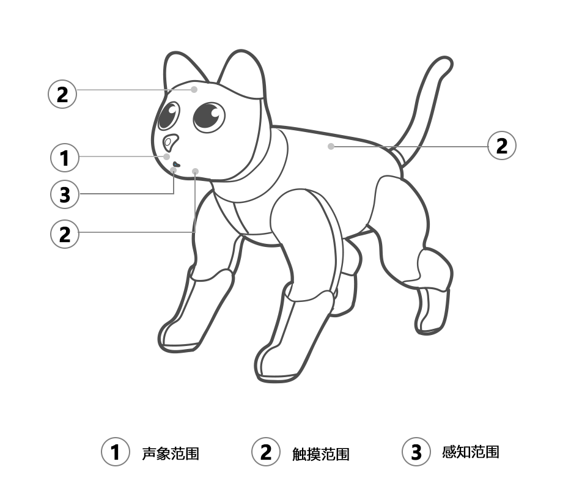
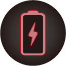

# 4.Raising MarsCat

## 4.1 How to interact with the MarsCat

MarsCat **touch range**、**camera range**、**distance range** ，as shown in figure①、②、③

Touching MarsCat's **body**, **forehead**, and **chin** triggers interaction with MarsCat (of course, cats may ignore your touch)

When **QR code/Ball/Teasre ** is within the range of MarsCat's camera and MarsCat is in observation mode, MarsCat will move to **QR code/Ball/Teasre ** and make corresponding actions

When MarsCat detects obstacles within **distance range** , it will automatically avoid obstacles (directly retreat to leave the obstacle area). Due to the current hardware characteristics, transparent obstacles cannot be recognized temporarily

## 4.2 How to raise a MarsCat

MarsCat can recognize MarsBowl for virtual feeding, allowing customers to enjoy a real cat-breeding experience. MarsCat will also make noises when they are eating or drinking.

There are two situations in which MarsCat can feed themselves. One is when MarsCat recognizes its MarsBowl, another is when MarsCat is thirsty or hungry, MarsCat will automatically look for its MarsBowl.

Step 1: Assemble the cat bowl. For details, please refer to [MarsCat and Accessories](./ 2-Marscat -and-accessories. Md)

Step 2: Place the cat bowl in place

**Note:** Place MarsBowl near MarsCat active area or Charging Station, make sure the surroundings are clean and tidy.

## 4.3 How to charge

**4.3.1 Automatic charging**

Step1: Connect the charger to the Charging Station and the power socket.

Step2: Be sure to allow clearance around the charging station as shown below.

Step3: MarsCat will go to the charging station to charge itself **when its battery is lower than 15%(its eyes will show a low battery sign)**; **the charging station is within the range of its vision(3\*3m)**

MarsCat will not charge itself only if both the above two conditions are met.

Step4: The eyes display a low power animation when the MarsCat enters low power mode

| Eye image                                          | Meaning                                                                                                                                                                               |
| -------------------------------------------------- | ------------------------------------------------------------------------------------------------------------------------------------------------------------------------------------- |
|  | Low power, MarsCat needs to be charged         |

Step5: When MarsCat successfully finds the charging pile and starts charging, the eye animation will now change to charging

| Eye image                                          | Meaning                                                                                                                                                                               |
| -------------------------------------------------- | ------------------------------------------------------------------------------------------------------------------------------------------------------------------------------------- |
|            | MarsCat is charging                    |

Using a charging post, it takes **4-6 hours** to fully charge the battery .

Unplug the charger immediately after full charge to avoid damage to the charger or MarsCat due to prolonged charging heat.

**4.3.2 Manual charging**

When MarsCat fails to find its charging station, you need to charge it manually.
Lay down MarsCat on the charging station so that the charging pins on the belly are engaged with the charge connector on the charging station.

When charging the MarsCat using a power adapter, it takes approximately **3-4 hours** to fully charge the battery .