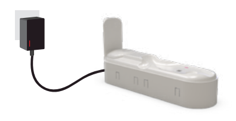
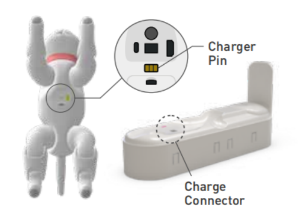

# 4.Raising MarsCat

## 4.1 How to raise a MarsCat

MarsCat can recognize MarsBowl for virtual feeding, allowing customers to enjoy a real cat-breeding experience. MarsCat will also make noises when they are eating or drinking.

There are two situations in which MarsCat can feed themselves. One is when MarsCat recognizes its MarsBowl, another is when MarsCat is thirsty or hungry, MarsCat will automatically look for its MarsBowl.

**Note:** Place MarsBowl near MarsCat active area or Charging Station, make sure the surroundings are clean and tidy.

## 4.2 How to charge

**4.2.1 Automatic charging**

Step1: Connect the charger to the Charging Station and the power socket.

Step2: Be sure to allow clearance around the charging station as shown below.

Step3: MarsCat will go to the charging station to charge itself **when its battery is lower than 15%(its eyes will show a low battery sign)**; **the charging station is within the range of its vision(3\*3m)**

MarsCat will not charge itself only if both the above two conditions are met.

Step4: When MarsCat is properly laid down, the battery starts charging and the status LED of the charger turns red.

Step5: When MarsCat is fully charged, the status LED of the charger turns green.

It takes approximately 4-6 hours to fully charge MarsCat.

Unplug the charger immediately after full charge to avoid damage to the charger or MarsCat due to prolonged charging heat.

**4.2.2 Manual charging**

When MarsCat fails to find its charging station, you need to charge it manually.
Lay down MarsCat on the charging station so that the charging pins on the belly are engaged with the charge connector on the charging station.

Or you can use the charger to charge MarsCat directly, other steps are the same as step4-5 in automatic charging.
